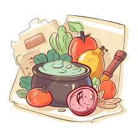

<a id="readme-top"></a>

[![Contributors][contributors-shield]][contributors-url]
[![Forks][forks-shield]][forks-url]
[![Stargazers][stars-shield]][stars-url]
[![Issues][issues-shield]][issues-url]
[![Unlicense License][license-shield]][license-url]

<!-- PROJECT LOGO -->
<br />
<div align="center">
    
  </a>

  <h3 align="center">Welcome to my Recipes Project!</h3>

  <p align="center">
      <a href="https://aranu29.github.io/odin-recipes/" target="blank" rel="noopener noreferrer"><strong>Explore My Recipes Website »</strong></a>
    <br />
    <br />
        <a>View Demo</a> 
        &middot;
        <a href="https://github.com/aranu29/odin-recipes/issues/new?template=bug_report.md">Report Bug</a>
        &middot;
        <a href="https://github.com/aranu29/odin-recipes/issues/new?template=feature_request.md">Request Feature</a>
  </p>
</div>


<!-- TABLE OF CONTENTS -->
<details>
    <summary>Table of Contents</summary>
    <ol>
        <li>
            <a href="#about-the-project">About The Project</a>
            <ul>
                <li><a href="#built-with">Built With</a></li>
            </ul>
        </li>
        <li>
            <a href="#getting-started">Getting Started</a>
            <ul>
                <li><a href="#prerequisites">Prerequisites</a></li>
                <li><a href="#installation">Installation</a></li>
            </ul>
        </li>
        <li><a href="#usage">Usage</a></li>
        <li><a href="#roadmap">Roadmap</a></li>
        <li><a href="#contributing">Contributing</a></li>
        <li><a href="#license">License</a></li>
        <li><a href="#contact">Contact</a></li>
        <li><a href="#acknowledgments">Acknowledgments</a></li>
    </ol>
</details>


<!-- ABOUT THE PROJECT -->
## About The Project

This project is my take on the “Recipes” assignment from The Odin Project’s Foundations Course. It showcases a simple multi-page website built using HTML and CSS, featuring a collection of my favorite recipes. The goal of the project was to reinforce core web development concepts such as semantic HTML structure and hyperlinking between pages while having fun with food content. I added some styling with CSS.

Each recipe page highlights a unique dish, complete with a description, ingredient list, and step-by-step instructions. This project served as a hands-on introduction to web development fundamentals and version control using Git. 
<p align="right">(<a href="#readme-top">back to top</a>)</p>


### Built With

* [![HTML][HTML]][HTML-url]
* [![CSS][CSS]][CSS-url]

<p align="right">(<a href="#readme-top">back to top</a>)</p>


<!-- GETTING STARTED -->
## Getting Started

Follow these steps to clone, explore, and run the project locally on your machine.

### Prerequisites
To get started, you’ll need the following:

- A modern web browser (e.g., Chrome, Firefox, Edge)
- [Git](https://git-scm.com/) installed on your local machine (optional but recommended)
- A code editor like [VS Code](https://code.visualstudio.com/)

### Installation

Follow the steps below to run the project locally:

1. **Clone the repository**
```bash
git clone https://github.com/your-username/recipes.git
```

2. **Navigate into the project folder**
cd recipes

3. **Open the main page in your browser**

Option A: Open index.html directly from your file explorer

Option B (Recommended): Use Live Server in VS Code
- Open the folder in VS Code
- Install the "Live Server" extension (if not already installed)
- Right-click index.html and select "Open with Live Server"

<p align="right">(<a href="#readme-top">back to top</a>)</p>


<!-- USAGE EXAMPLES -->
## Usage

This is a beginner-level static website project for practicing:

1. Semantic HTML5
2. CSS styling and layout
3. Internal and external navigation using anchor tags
4. Clean code structure and best practices
<p align="right">(<a href="#readme-top">back to top</a>)</p>


<!-- ROADMAP -->
## Roadmap

- [x] Add back to top links
- [ ] Add link to website
- [ ] Add link to demo
- [ ] Complete "Getting Started" section
- [ ] Add changelog
- [ ] Add license


See the [open issues](https://github.com/aranu29/odin-recipes/issues) for a full list of proposed features (and known issues).

<p align="right">(<a href="#readme-top">back to top</a>)</p>


<!-- CONTRIBUTING -->
## Contributing

Contributions are the heart of the open source community — they help us all learn, grow, and build together. Any improvements, big or small, are always welcome and **deeply appreciated**.

Have an idea to make this project better?

1. Fork the Repository
2. Create a New Branch (`git checkout -b feature/AmazingFeature`)
3. Commit your Changes (`git commit -m 'Add AmazingFeature'`)
3. Push to your Branch (`git push origin feature/AmazingFeature`)
4. Open a Pull Request

Prefer to suggest an enhancement instead? Feel free to open an issue and tag it with "enhancement".

And if you like the project, don’t forget to ⭐ it — thanks for your support!


### Top contributors:

<a href="https://github.com/aranu29/odin-recipes/graphs/contributors">
  
</a>

<p align="right">(<a href="#readme-top">back to top</a>)</p>


<!-- LICENSE -->
## License

TBA

<p align="right">(<a href="#readme-top">back to top</a>)</p>


<!-- CONTACT -->
## Contact

- [![GitHub][github-shield]][github-url]
- [![LinkedIn][linkedin-shield]][linkedin-url]

<p align="right">(<a href="#readme-top">back to top</a>)</p>


<!-- ACKNOWLEDGMENTS -->
## Acknowledgments

<p align="right">(<a href="#readme-top">back to top</a>)</p>


<!-- MARKDOWN LINKS & IMAGES -->
<!-- https://www.markdownguide.org/basic-syntax/#reference-style-links -->
[contributors-shield]: https://img.shields.io/github/contributors/aranu29/odin-recipes.svg?style=for-the-badge
[contributors-url]: https://github.com/aranu29/odin-recipes/graphs/contributors
[forks-shield]: https://img.shields.io/github/forks/aranu29/odin-recipes.svg?style=for-the-badge
[forks-url]: https://github.com/aranu29/odin-recipes/network/members
[stars-shield]: https://img.shields.io/github/stars/aranu29/odin-recipes.svg?style=for-the-badge
[stars-url]: https://github.com/aranu29/odin-recipes/stargazers
[issues-shield]: https://img.shields.io/github/issues/aranu29/odin-recipes.svg?style=for-the-badge
[issues-url]: https://github.com/aranu29/odin-recipes/issues
[license-shield]: https://img.shields.io/github/license/aranu29/odin-recipes.svg?style=for-the-badge
[license-url]: https://github.com/aranu29/odin-recipes/blob/master/LICENSE.txt
[linkedin-shield]: https://custom-icon-badges.demolab.com/badge/LinkedIn-0A66C2?logo=linkedin-white&logoColor=fff
[linkedin-url]: https://www.linkedin.com/in/anuoluwa-akibu1/
[github-shield]: https://img.shields.io/badge/GitHub-%23121011.svg?logo=github&logoColor=white
[github-url]: https://github.com/aranu29/odin-recipes
[HTML]: https://img.shields.io/badge/HTML-%23E34F26.svg?logo=html5&logoColor=white
[HTML-url]: https://html.com/
[CSS]: https://img.shields.io/badge/CSS-1572B6?logo=css3&logoColor=fff
[CSS-url]: https://html.com/